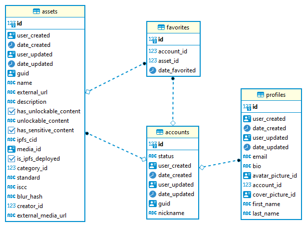

# Desafios Node.JS 101 (nível iniciante)


## Introdução

Esse é projeto de uma API REST simples de CRUD (acrônimo para CREATE, READ, UPDATE e DELETE).


É baseado num artigo que pode ser acessado no link abaixo:

https://blog.logrocket.com/nodejs-expressjs-postgresql-crud-rest-api-example/

O projeto foi criado com Node.JS e PostgreSQL.

Apesar de simples, ele está funcional para o CRUD em "accounts" (veja o arquivo index.js)

```javascript
app.get('/accounts', db.getAccounts)
app.get('/accounts/:id', db.getAccountsById)
app.post('/accounts', db.createAccount)
app.put('/accounts/:id', db.updateAccount)
app.delete('/accounts/:id', db.deleteAccount)
```

O banco de dados foi criado e alimentado com dados da base pública do site de fotografias ["unsplash"](https://unsplash.com), porém adaptada para nossa realidade do mundo de criptioativos.

Segue uma descrição das tabelas e campos relevantes:

- accounts: tabela de contas de usuário 
  
  - id: identificador numérico e sequencial do registro
  - guid: identificação única da conta (gerado automaticamente)
  - nickname: nome de usuário, que também deve ser único
  - status: "draft" ou "published", indicando se a conta está em edição ou publicada 

- profiles: tabela de dados adicionais referente ao perfil do usuário

  - id: identificador numérico e sequencial do registro
  - first_name: primeiro nome do usuário
  - last_name: último nome do usuário

- assets: tabela de criptoativos (no caso, fotografias digitais)
  
  - id: identificador numérico e sequencial do registro
  - guid: identificação única do ativo (gerado automaticamente)
  - name: nome do ativo
  - external_url: endereço WEB com informações do ativo (link para fotografia no unsplash)
  - external_media_url: endereço WEB do criptoativo (link para a imagem da fotografia original no unsplash)

- favorites: tabela de ativos favoritados pelos usuários

  - id: identificador numérico e sequencial do registro
  - account_id: identificação do usuário que favoritou
  - asset_id: identificação do criptoativo favoritado
  - date_favorited: quando o criptoativo foi favoritado pelo usuário

Abaixo segue um "Diagrama de Entidades e Relacionamentos" reduzido do banco de dados:





## Desafios (por ordem de dificuldade)

1. Faça um CRUD para "profiles" (lembre-se que "profiles" está relacionada com "accounts") e publique os endpoints na API.

2. Crie um endpoint para mostrar os 10 criptoativos mas favoritados.

3. Crie um script Node.JS que salve a fotografia original (url da imagem no unsplash) dos 10 criptoativos mais favoritados na pasta "downloads". 

4. Crie um script que gere um "thumnail" (imagem reduzida) das fotografias que estão em "downloads" e salve em "thumbnails":
   - A imagem reduzida deve ser salva como "jpeg";
   - A imagem reduzida deve ter sua a maior dimensão (altura ou largura) de 128 pixels e manter a proporção original;
   - A imagem reduzida deve ter a qualidade (compressão) de 50%.

